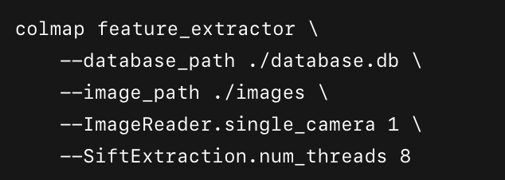
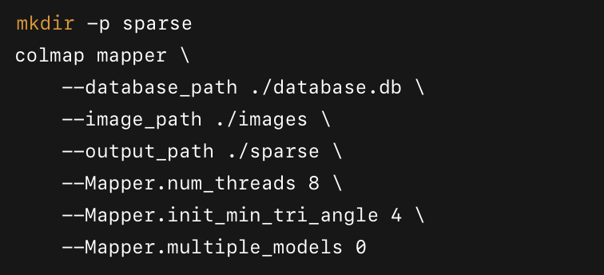
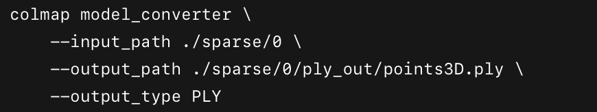
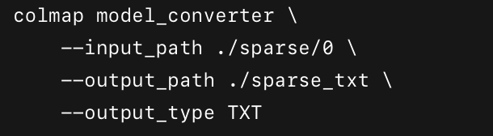
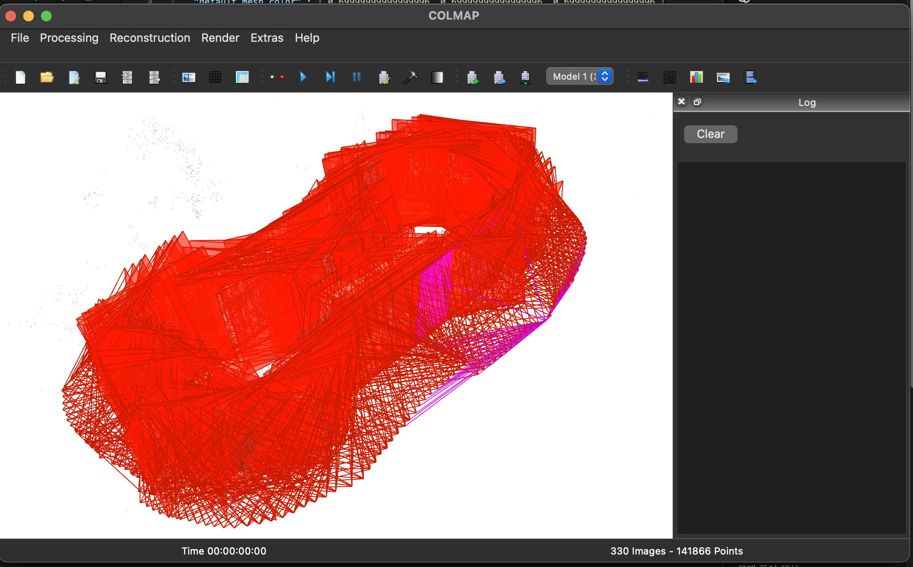
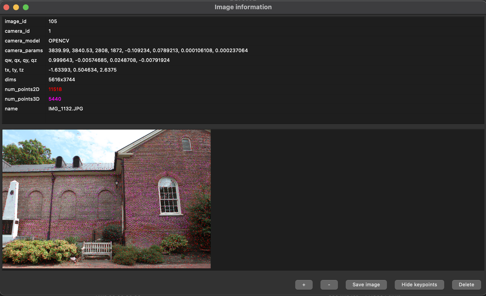
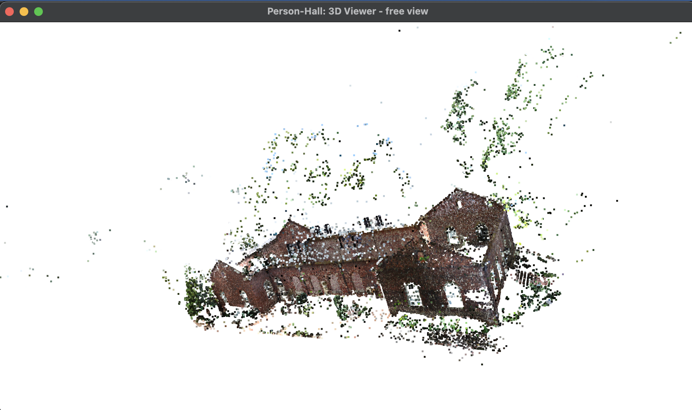
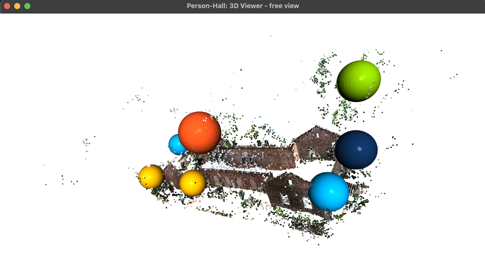
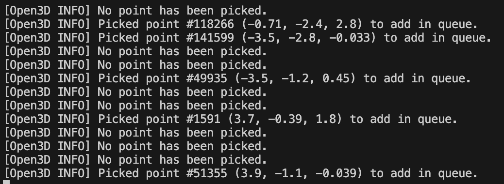
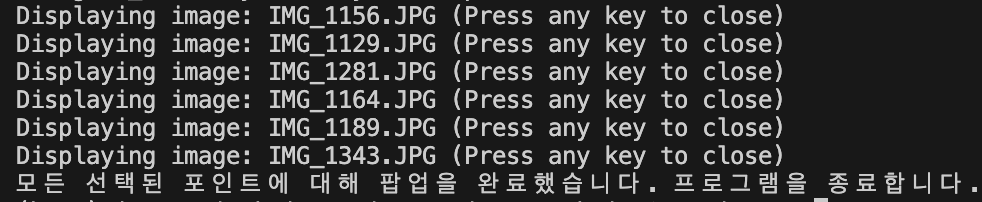

# Person‐Hall SfM & 3D Visualization

이 리포지터리는 COLMAP을 이용해 “person-hall” 이미지 세트를 Structure-From-Motion(SfM)으로 처리한 뒤, Python(Open3D+OpenCV) 스크립트를 통해 3D 점군에서 포인트를 선택하면 해당 사진이 팝업되는 기능을 구현했습니다.

---

## 프로젝트

1. Feature Extraction

- `--database_path ./database.db`: SIFT 키포인트·디스크립터를 저장할 SQLite DB 생성
- `--image_path ./images`: 원본 이미지가 들어 있는 폴더
- `--ImageReader.single_camera 1`: 모든 이미지를 단일 카메라 모델로 취급
- `--SiftExtraction.num_threads 8`: 멀티스레드(코어 수) 설정

2. Feature Matching

- `--database_path ./database.db`: 이전 단계에서 생성된 DB 사용
- `--SiftMatching.num_threads 8`: 멀티스레드 매칭

3. Sparse Reconstruction (Mapper)

- `--output_path ./sparse` : 결과를 sparse/0/ 폴더에 저장
- `--Mapper.num_threads 8`: 멀티스레드 맵핑
- `--Mapper.init_min_tri_angle 4`: 초기 두 뷰 삼각측량 최소 각도 4도
- `--Mapper.multiple_models 0`: 하나의 모델만 생성

4. Sparse → PLY 변환

- `--input_path ./sparse/0`: 바이너리 결과 폴더
- `--output_path ./sparse/0/ply_out/points3D.ply`: 생성될 PLY 파일 경로
- `--output_type PLY`: PLY 형식으로 출력

5. Sparse → TXT 변환

- `--output_path` : ./sparse_txt: cameras.txt, images.txt, points3D.txt 생성

- **visualize_person_hall.py**  
  Python 스크립트: 3D 뷰어에서 포인트 선택 시 해당 사진 팝업

**colmap GUI**

Open3D 뷰어 창이 뜹니다.

Shift + 왼쪽 클릭으로 “포인트 하나 이상”을 선택하세요.

(여러 점을 골라도 됩니다. 각 점들에 가장 가까운 카메라 이미지를 찾습니다.)

# 사용법:
- 마우스 왼쪽 버튼 드래그: 씬 회전
- 오른쪽 버튼(또는 휠 버튼) 드래그: 씬 평행 이동
- 휠 스크롤: 화면 확대/축소
- 선택을 마쳤으면, Q(또는 Esc) 키를 눌러 뷰어 창을 닫습니다.
- 뷰어가 닫히면, picked_ids = vis.get_picked_points() 를 통해 “선택된 포인트 인덱스 목록”을 가져옵니다.

선택된 각 인덱스별로:

1. 해당 3D 포인트 좌표(pt)를 가져옵니다.
2. camera_poses 에서 미리 구해둔 “모든 카메라 위치 좌표”와 비교해, 가장 가까운 카메라를 찾습니다.
3. 그 카메라(이미지) 이름(파일명)을 images/ 폴더에서 찾아 OpenCV 창으로 띄웁니다.
4. 같은 이미지가 중복으로 뜨지 않도록 seen_images 집합을 만들어 관리합니다.
5. 모든 선택된 포인트에 대해 팝업을 띄우고 나면, 콘솔에 “모든 선택된 포인트에 대해 팝업을 완료했습니다. 프로그램을 종료합니다.” 라는 메시지가 출력되며 프로그램이 끝납니다.

## 📦 대용량 파일 다운로드

4GB 데이터 파일은 용량 제한으로 인해 GitHub에 직접 포함되지 않았습니다.  
아래 링크를 통해 Google Drive에서 다운로드할 수 있습니다:

🔗 [Google Drive로 이동](https://drive.google.com/file/d/1ydHn-Xp8cNX7QNxc8W-sJjiDoSzSHVBk/view?usp=share_link)

**person-hall.zip파일구조**
- **person-hall/**
  - **images/**
    - img1015.jpg
    - img1016.jpg
    - …
    
  - **database.db**  
    COLMAP Feature Extraction 및 Matching 결과 (SQLite DB)

  - **sparse/**
    - **0/**
      - `cameras.bin` : COLMAP Mapper가 생성한 카메라 파라미터 (바이너리)
      - `images.bin`  : COLMAP Mapper가 생성한 이미지별 포즈 정보 (바이너리)
      - `points3D.bin`: COLMAP Mapper가 생성한 3D 포인트클라우드 (바이너리)
      - `project.ini` : COLMAP 프로젝트 설정 파일
      - **ply_out/**
        - `points3D.ply` : PLY 형식으로 변환된 스파스 포인트클라우드 (시각화용)

  - **sparse_txt/**
    - `cameras.txt` : 카메라 내부 파라미터 (텍스트)
    - `images.txt` : 이미지별 쿼터니언·이동벡터·파일명 (텍스트)
    - `points3D.txt` : 3D 포인트 정보 (텍스트)

참고자료 : https://colmap.github.io/datasets.html# (데이터 셋 활용)